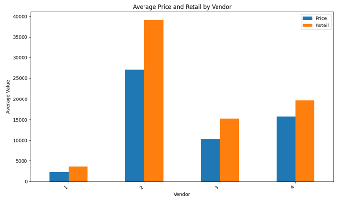
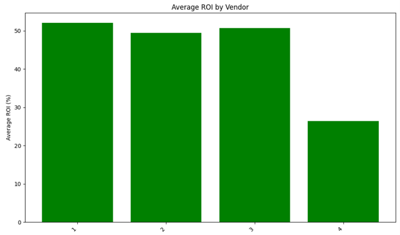
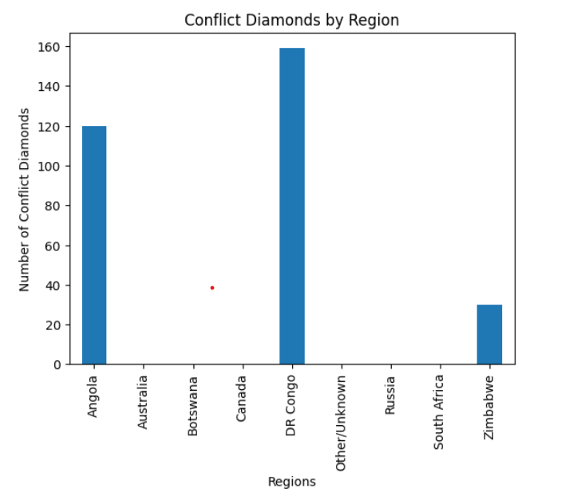
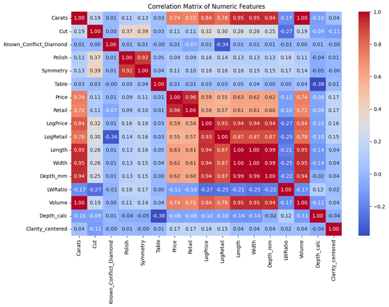
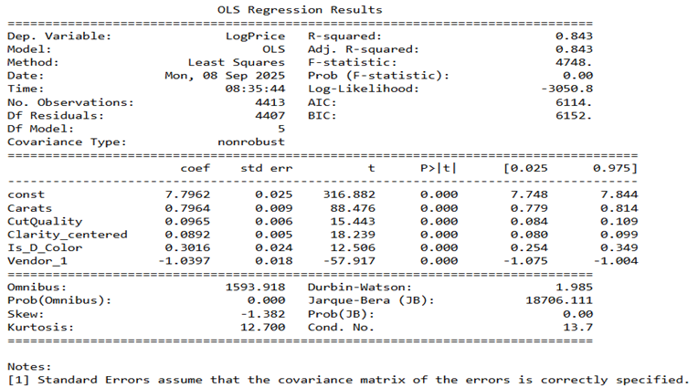
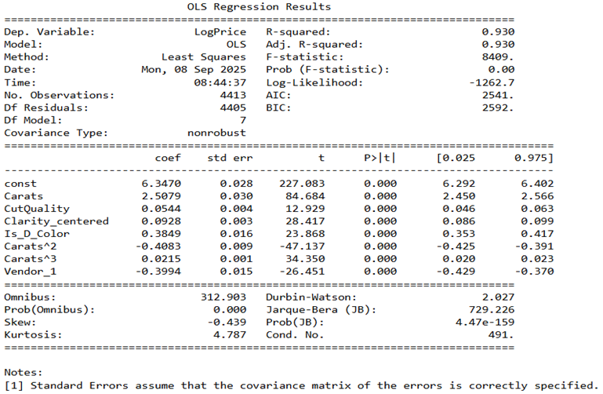

# Diamond Price Prediction  
**By Nikola Stojkovski**  

---

## Methodology  

### Problem Statement  
The goal of this project is to predict diamond prices in order to optimize purchasing decisions under budget constraints. Two primary constraints guide the decision-making process:

- Total budget of $5,000,000.  
- Rejected offers still count toward the total budget.  

The objective is to maximize expected profit while minimizing risk. This requires identifying diamonds with the highest ROI within the budget and applying a safety buffer in offer pricing to account for potential rejections.

Additionally, the analysis explores vendor pricing behavior and the relationship between carat size and retail price to inform the final offer strategy.

---

## Data  
Two datasets were provided:

- **Training data:** historical sales information.  
- **Offers data:** details of diamonds currently for sale.  

Both datasets include attributes such as Carats, Certification Organization, Clarity, Color, Cut, Depth Percentage, Conflict Diamond Status, Measurements, Polish, Country of Origin, Shape, Symmetry, Table Percentage, and Vendor.  

The Training dataset also contains accepted offer and retail price information, along with their natural log transformations.

---

## Data Cleaning and Preprocessing  
Both datasets contained a substantial amount of missing data. Key points:

- The **Known_Conflict_Diamond** column was complete in Training but 90% missing in Offers.  
- Missing certification values were encoded; a single missing clarity value was removed.  
- Depth percentage was recalculated from measurements.  
- Cut, Polish, and Symmetry were converted to numeric ordinal values; missing entries replaced with 0.  
- Clarity was converted to numeric ordinal values.  
- Shape inconsistencies were corrected.  
- Sparse color categories (very light/fancy) were consolidated and converted into dummy variables.  
- Measurements were split into Length, Width, Depth and used to calculate:  
  - **Volume = Length × Width × Depth**  
  - **Length-to-Width Ratio = Length / Width**  
  - **Depth Percentage = Depth / ((Length + Width)/2) × 100**  
- Remaining categorical features (Certification, Shape, Region, Vendor) were one-hot encoded.  

---

## Exploratory Data Analysis  

**Vendor Analysis:**  

- Vendor 1 charges the least per diamond, Vendor 2 the most.  
- ROI analysis shows Vendor 4 has the lowest average ROI (~20% below others), indicating overpricing.  
- Vendor 2 sells larger diamonds, suggesting a focus on luxury diamonds; Vendor 1 focuses on smaller, affordable diamonds.  

**Conflict Diamonds:**  

- Conflict diamonds appear only from Angola, DRC, and Zimbabwe.  
- Diamonds from other regions (Australia, Botswana, Canada, Russia, South Africa) marked as non-conflict.  
- Minor risk of misclassification exists, but Training dataset is assumed representative.  

**Correlation Analysis:**  

- Carats are the main driver of price, with volume metrics highly collinear.  
- Conflict status negatively correlates with log retail price (-0.34), confirming significance.  

**Figures Placeholder:**  
   
  
   
   

---

## OLS Regression  

- Initial OLS regression: adjusted R² = 0.843.  
- Polynomial (squared & cubic) terms for carats improved adjusted R² to 0.930 → cubic relationship confirmed.  
- Log retail price model: adjusted R² increased from 0.853 → 0.925.  
- Conflict diamond variable remains significant.  

**Tables Placeholder:**  
  
  

Data was segmented into diamonds with known vs. unknown conflict status for modeling.

---

## Model Building  

- Four models:  
  1. Known conflict → log(Price)  
  2. Missing conflict → log(Price)  
  3. Known conflict → log(Retail)  
  4. Missing conflict → log(Retail)  

- Tested XGBoost, LightGBM, CatBoost. XGBoost selected for speed.  
- Models 1–3: test R² > 0.98.  
- Model 4: test R² = 0.8623 → conflict status important.  
- Attempts to impute conflict had limited improvement.  

---

## Offer Optimization  

- Applied a 30% conservative buffer to predicted prices to reduce rejection risk.  
- Algorithm ranked diamonds by estimated ROI and iteratively allocated offers under budget constraints.  
- A 10% buffer was applied during final offer generation to balance acceptance and profit.  
- Proposed offers merged with Offers dataset for final submission.  

---

## Key Findings and Insights  

- **Vendor Pricing:** Vendor 4 overprices, Vendor 2 offers best ROI.  
- **Price Drivers:** Carat size exhibits strong cubic relationship with price.  
- **Conflict Status:** Missing conflict data reduces model accuracy; conflict diamonds negatively impact price.  
- **Model Performance:** XGBoost test R² ≈ 0.98.  

---

## Limitations and Future Work  

- Improve imputation of missing conflict status.  
- Model offer rejection probability to optimize buffer.  
- Integrate external market data for robust forecasting.  

---

## Conclusion  

This project demonstrates an end-to-end workflow for predicting diamond prices and optimizing purchasing strategies under budget and uncertainty constraints. Preprocessing, EDA, regression analysis, and tree-based modeling achieved high predictive accuracy and revealed actionable business insights on vendor behavior and market structure.
